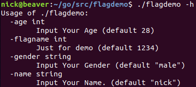

# Golang  flag 包简介

在 Golang 程序中有很多种方法来处理命令行参数。简单的情况下可以不使用任何库，直接处理 os.Args；其实 Golang 的标准库提供了 flag 包来处理命令行参数；还有第三方提供的处理命令行参数的库，比如 Pflag 等。本文将介绍 Golang 标准库中 flag 包的用法。本文的演示环境为 ubuntu 18.04。

## 入门 demo

在 Go workspace 的 src 目录下创建 flagdemo 目录，并在目录下创建 main.go 文件，编辑其内容如下：

```go
package main

import "flag"
import "fmt"

// 定义命令行参数对应的变量，这三个变量都是指针类型
var cliName = flag.String("name", "nick", "Input Your Name")
var cliAge = flag.Int("age", 28, "Input Your Age")
var cliGender = flag.String("gender", "male", "Input Your Gender")

// 定义一个值类型的命令行参数变量，在 Init() 函数中对其初始化
// 因此，命令行参数对应变量的定义和初始化是可以分开的
var cliFlag int
func Init() {
    flag.IntVar(&cliFlag, "flagname", 1234, "Just for demo")
}

func main() {
    // 初始化变量 cliFlag
    Init()
    // 把用户传递的命令行参数解析为对应变量的值
    flag.Parse()
    
    // flag.Args() 函数返回没有被解析的命令行参数
    // func NArg() 函数返回没有被解析的命令行参数的个数
    fmt.Printf("args=%s, num=%d\n", flag.Args(), flag.NArg())
    for i := 0; i != flag.NArg(); i++ {
        fmt.Printf("arg[%d]=%s\n", i, flag.Arg(i))
    }
    
    // 输出命令行参数
    fmt.Println("name=", *cliName)
    fmt.Println("age=", *cliAge)
    fmt.Println("gender=", *cliGender)
    fmt.Println("flagname=", cliFlag)
}
```

使用 flag 包前要通过 import 命令导入该包：

```go
import "flag"
```

定义一个整型的参数 age，返回指针类型的变量：

```go
var cliAge = flag.Int("age", 28, "Input Your Age")
```

创建值类型的参数变量，并在 Init() 函数中对其初始化(注意这里调用的是 flag.IntVar 方法)：

```go
var cliFlag int
func Init() {
    flag.IntVar(&cliFlag, "flagname", 1234, "Just for demo")
}
```

通过 flag.Parse() 函数接下命令行参数，解析函数将会在碰到第一个非 flag 命令行参数时停止：

```go
flag.Parse()
```

命令行传参的格式：

```go
-isbool    (一个 - 符号，布尔类型该写法等同于 -isbool=true)
-age=x     (一个 - 符号，使用等号)
-age x     (一个 - 符号，使用空格)
--age=x    (两个 - 符号，使用等号)
--age x    (两个 - 符号，使用空格)
```

## 运行 demo

在 flagdemo 目录下执行 go build 命令编译 demo 生成可执行文件 flagdemo。
**不传递命令行参数**


此时输出的命令行参数都是定义的默认值。

**传递命令行参数**


传递的命令行参数会覆盖默认值。

**传递多余的命令行参数**


可以通过 flag.Args() 和 flag.NArg() 函数获取未能解析的命令行参数。

**传递错误的命令行参**


如果通过 -xx 传入未定义的命令行参数，则会直接报错退出，并输出帮助信息。

**查看帮助信息**
通过命令行参数 -h 或 --help 可以查看帮助信息：



## 解读 flag 包源码

flag 包支持的类型有 Bool、Duration、Float64、Int、Int64、String、Uint、Uint64。这些类型的参数被封装到其对应的后端类型中，比如 Int 类型的参数被封装为 intValue，String 类型的参数被封装为 stringValue。这些后端的类型都实现了 Value 接口，因此可以把一个命令行参数抽象为一个 Flag 类型的实例。下面是 Value 接口和 Flag 类型的代码：

```go
// Value 接口
type Value interface {
    String() string
    Set(string) error
}

// Flag 类型
type Flag struct {
    Name     string // name as it appears on command line
    Usage    string // help message
    Value    Value  // value as set 是个 interface，因此可以是不同类型的实例。
    DefValue string // default value (as text); for usage message
}
```

intValue 等类型实现了 Value 接口，因此可以赋值给 Flag 类型中的 Value 字段，下面是 intValue 类型的定义：

```go
// -- int Value
type intValue int

func newIntValue(val int, p *int) *intValue {
    *p = val
    return (*intValue)(p)
}

func (i *intValue) Set(s string) error {
    v, err := strconv.ParseInt(s, 0, strconv.IntSize)
    *i = intValue(v)
    return err
}

func (i *intValue) Get() interface{} { return int(*i) }
func (i *intValue) String() string { return strconv.Itoa(int(*i)) }
```

所有的参数被保存在 FlagSet 类型的实例中，FlagSet 类型的定义如下：

```go
// A FlagSet represents a set of defined flags.
type FlagSet struct {
    Usage func()

    name          string
    parsed        bool
    actual         map[string]*Flag    // 中保存从命令行参数中解析到的参数实例
    formal        map[string]*Flag    // 中保存定义的命令行参数实例(实例中包含了默认值)
    args          []string // arguments after flags
    errorHandling ErrorHandling
    output        io.Writer // nil means stderr; use out() accessor
}
```

Flag 包被导入时创建了 FlagSet 类型的对象 CommandLine：

```go
var CommandLine = NewFlagSet(os.Args[0], ExitOnError)
```

在程序中定义的所有命令行参数变量都会被加入到 CommandLine 的 formal 属性中，其具体的调用过程如下：

```go
var cliAge = flag.Int("age", 28, "Input Your Age")
func Int(name string, value int, usage string) *int {
    return CommandLine.Int(name, value, usage)
}
func (f *FlagSet) Int(name string, value int, usage string) *int {
    p := new(int)
    f.IntVar(p, name, value, usage)
    return p
}
func (f *FlagSet) IntVar(p *int, name string, value int, usage string) {
    f.Var(newIntValue(value, p), name, usage)
}
func (f *FlagSet) Var(value Value, name string, usage string) {
    // Remember the default value as a string; it won't change.
    flag := &Flag{name, usage, value, value.String()}
    _, alreadythere := f.formal[name]
    if alreadythere {
        var msg string
        if f.name == "" {
            msg = fmt.Sprintf("flag redefined: %s", name)
        } else {
            msg = fmt.Sprintf("%s flag redefined: %s", f.name, name)
        }
        fmt.Fprintln(f.Output(), msg)
        panic(msg) // Happens only if flags are declared with identical names
    }
    if f.formal == nil {
        f.formal = make(map[string]*Flag)
    }
    // 把命令行参数对应的变量添加到 formal 中
    f.formal[name] = flag
}
```

命令行参数的解析过程则由 flag.Parse() 函数完成，其调用过程大致如下：

```go
func Parse() {
    CommandLine.Parse(os.Args[1:])
}
func (f *FlagSet) Parse(arguments []string) error {
    f.parsed = true
    f.args = arguments
    for {
        seen, err := f.parseOne()
        if seen {
            continue
        }
        if err == nil {
            break
        }
        switch f.errorHandling {
        case ContinueOnError:
            return err
        case ExitOnError:
            os.Exit(2)
        case PanicOnError:
            panic(err)
        }
    }
    return nil
}
```

最终由 FlagSet 的 parseOne() 方法执行解析任务：

```go
func (f *FlagSet) parseOne() (bool, error) {
…
flag.Value.Set(value)
…
f.actual[name] = flag
…
}
```

并在解析完成后由 flag.Value.Set 方法把用户传递的命令行参数设置给 flag 实例，最后添加到 FlagSet 的 actual 属性中。

## 总结

本文介绍了 Golang 标准库中 flag 包的基本用法，并进一步分析了其主要的代码逻辑。其实 flag 包还支持用户自定义类型的命令行参数，本文不再赘述，有兴趣的朋友请参考官方 demo。

**参考：**
[package flag](https://golang.org/pkg/flag/)
[Go by Example: Command-Line Flags](https://gobyexample.com/command-line-flags)
[USING COMMAND LINE FLAGS IN GO](https://flaviocopes.com/go-command-line-flags/)
[Golang之使用Flag和Pflag](https://o-my-chenjian.com/2017/09/20/Using-Flag-And-Pflag-With-Golang/)
[Go语言学习之flag包(The way to go)](https://blog.csdn.net/wangshubo1989/article/details/72914384?locationNum=14&fps=1)
[Golang flag demo](https://golang.org/pkg/flag/#example_)